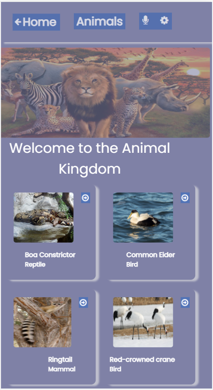
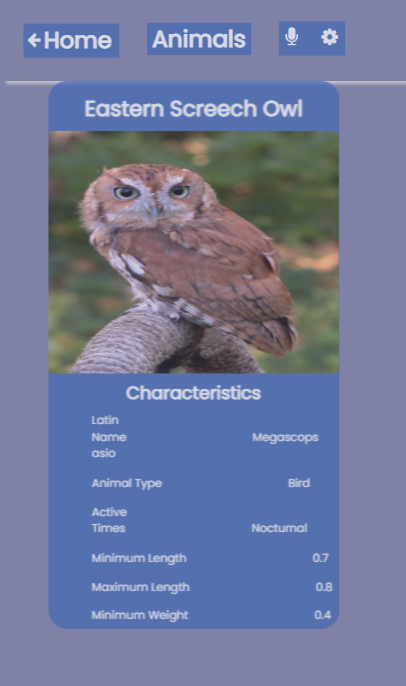

# Metrics-Webapp

"Metrics-Webapp" is an app that displays a list of popular stock market prices. Users can click on selected categories including forex, majors, cryptocurrencies, stocks, and ETFs. Each category lists the latest prices update for the pair. Consumes the Financial Modeling Prep API.

The present project is part of the Microverse curriculum Module 3 Block 5 Capstone Project. The main objective is putting hands on practice to build a web application using React and API.

#### Home page


#### Details page


## Built With

- JavaScript
- React
- Redux
- Jest

## Additional Tools

- Webhint
- Stylelint
- Eslint
- Lighthouse
- Webpack
- API

## Live Demo 

Live Demo Link found [Here](https://carshy.github.io/metrics-webapp/)

Presentation video [Here](https://www.loom.com/share/d558868d35e1445fb35191369112b273)

## Getting Started

To get a local copy of this project:

Clone this repository or download the Zip folder:
```
https://github.com/Carshy/metrics-webapp.git
```
 
In the project directory, you can run:

### `npm install`

### `npm start`

### `npm test`

### `npm run build`

### `npm run eject`

### `npm run build` fails to minify

That's it! You can play with it as you wish :smile:

## Authors

👤 **Collins Musoko**

- GitHub: [@Github](https://github.com/Carshy)
- Twitter: [@Twitter](https://twitter.com/CarshyCollins)
- Linkedin: [Linkedin](https://www.linkedin.com/in/collins-musoko-864881120/)

## Show your support

Give a ⭐️ if you like this project!

## 🤝 Contributing

Contributions, issues, and feature requests are welcome!
Feel free to check the [issues page](https://github.com/Carshy/metrics-webapp/issues).

## Show your support

Give a ⭐️ if you like this project!

## Acknowledgments

- This project is part of week 1 of module 3 in the Microverse study program.
- Thanks to the Microverse team for the great curriculum 🙌.
- Thanks to Code Reviewers for the insightful feedback ⚡.
- A great thanks to [Nelson Sakwa on Behance](https://www.behance.net/sakwadesignstudio) for design contributions 💘.

## 📝 License

This project is [MIT](https://github.com/Carshy/readme-template/blob/master/MIT.md) licensed.
